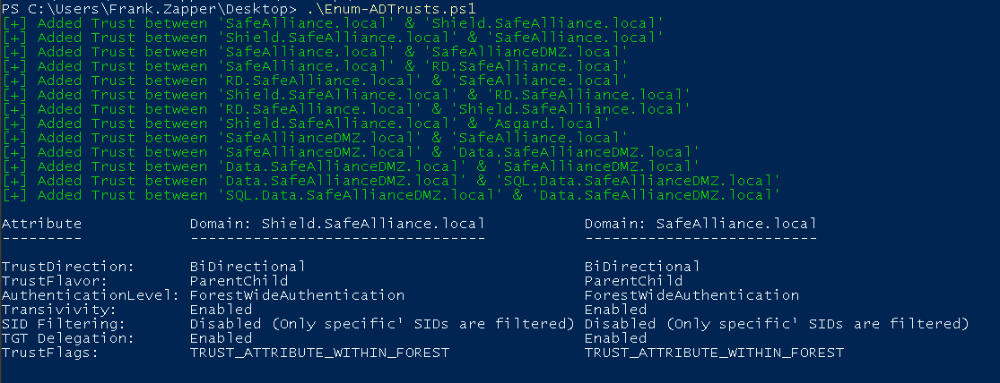
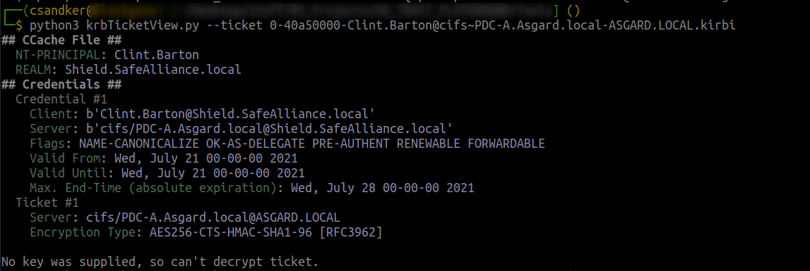
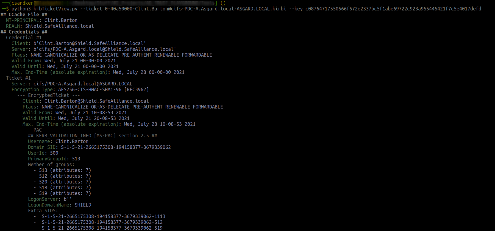

# AD-Trusts-Tooling

Tools for our Active Directory Spotlight about Trusts. Read the blogs here:

[Active Directory Spotlight: Trusts — Part 1. The Mechanics](https://medium.com/sse-blog/active-directory-spotlight-trusts-part-1-the-mechanics-7a3eb26ef4d8)<br>
[Active Directory Spotlight: Trusts — Part 2. Operational Guidance](https://medium.com/sse-blog/active-directory-spotlight-trusts-part-2-operational-guidance-ada54ac3bf13)

Both tools are described in Part 2 of the spotlight, linked above.

## Enum-ADTrusts.ps1

```Powershell
Enum-ADTrusts.ps1
```



## krbTicketView.py

```python
python3 krbTicketView.py --ticket <Ticket.kirbi>
```



```python
python3 krbTicketView.py --ticket <Ticket.kirbi> --key <TicketKey>
```


