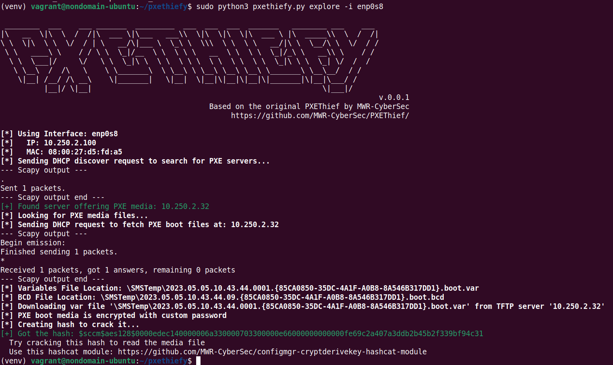

# pxethiefy.py

pxethiefy is a tool to enumerate PXE boot media provided from an SCCM server in a target network by broadcasting for PXE servers, requesting offered boot media and trying to decrypt it.  

This tool is heavily based on the tool [PXEThief](https://github.com/MWR-CyberSec/PXEThief).
While [PXEThief](https://github.com/MWR-CyberSec/PXEThief) is a Windows-based tool (and provides more features), `pxethiefy.py` has a limited feature set, but can be used from Linux hosts as well.
**Shoutout and all credits go to [MWR-CyberSec](https://github.com/MWR-CyberSec/)**.

This tool is a byproduct of SCCM research, which can be found in this blog: [TOOD](TODO)

## Usage

Sample from an SCCM lab with encrypted PXE boot media:

In case the PXE boot media is encrypted, [this](https://github.com/MWR-CyberSec/configmgr-cryptderivekey-hashcat-module) hashcat module - once again by [MWR-CyberSec](https://github.com/MWR-CyberSec/) - can be used to decrypt the downloaded media file.

Once the password has been cracked, `pxethiefy.py` can be used to read the media file and show potential next steps:

